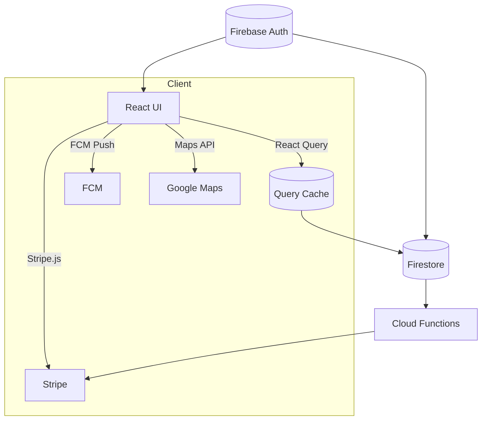

<h1 align="center">
  <br/>
  <strong>Volio – Современный Центр Волонтёрства</strong>  
</h1>

<p align="center">
  <a href="https://github.com/volio/volio/actions">
    
  </a>
  
  
</p>

> **Volio** — это полнофункциональная платформа для волонтёров в реальном времени, помогающая людям объединять усилия,  
> малым НКО публиковать события, и сообществам становиться сильнее – всё на трёх языках 🇰🇿 🇷🇺 🇺🇸.

---

## ✨ Почему Volio?

| ✨ Функция | 💡 Что она даёт |
|-----------|---------------------|
| **Динамичный Просмотр Карты** | Google Maps с настраиваемыми слоями (`онлайн`, `официальные`, `неформальные`) и живой кластеризацией |
| **Центр Малых Организаций**   | Платформа на основе подписки для малых НКО — неограниченное количество событий |
| **Система Друзей и Лента** | Запросы ✅ · новостная лента 📣 · приглашения в приложении 💌 |
| **Подбор по Топ-3 Бейджам** | Сверхбыстрое ранжирование кандидатов для организаторов — сопоставление навыков с событиями |
| **QR-коды на Бейджах** | Сканирование → профиль → добавление в друзья / форма обратной связи менее чем за 3 с |
| **Панель Активных Событий** | Ваш "центр управления" на домашней странице — чаты, задачи, документы в один клик |
| **Динамическое Меню** | Автоматическое построение навигации на основе ролей (Волонтёр, Организация, Администратор, …) |
| **Чат в Реальном Времени** | Ветки обсуждений, эмодзи-реакции, голосовые заметки, инструменты модерации |
| **Светлая / Тёмная темы** | Тщательно настроенные цветовые схемы для контраста AAA |
| **100% Мультиязычность** | Интерфейс на 🇰🇿 Казахском, 🇷🇺 Русском, 🇺🇸 Английском (с отложенной загрузкой словарей) |

---

## 🖼️ Скриншоты

| Главная (тёмная) | Профиль | Мероприятия |
|-------------|---------|------------|
|  |  |  |

*(Больше в `docs/assets`)*

---

## 🏗️ Технологический Стек

| Слой | Технологии |
|-------|------|
| **Фронтенд** | React + TypeScript · Vite · TailwindCSS (с дизайн-токенами) · Framer Motion |
| **Управление Данными** | React Query + Firebase Firestore (правила v2) |
| **Аутентификация** | Firebase Auth + настраиваемые утверждения (`role`) |
| **Карты** | Google Maps JS API (v = weekly) · @googlemaps/marker-clusterer |
| **Чат** | Firestore подколлекции + Cloud Storage для вложений |
| **Платежи** | Stripe Checkout (для подписки Малых НКО) |
| **Инфраструктура / CI** | GitHub Actions · pnpm workspace · ESLint + Prettier · Jest & React-Testing-Library |
| **Диаграммы** | Mermaid для документации архитектуры |

---

## 🗂 Структура Монорепозитория (pnpm)

```
volio/
 ├─ apps/
 │   └─ web/           – React клиент (Vite)
 ├─ packages/
 │   ├─ ui/            – Переиспользуемые UI компоненты и Tailwind пресеты
 │   ├─ shared/        – TypeScript модели и утилиты
 │   └─ functions/     – Firebase Cloud Functions (приглашения, биллинг, хуки)
 ├─ .github/
 │   └─ workflows/ci.yml
 └─ docs/
```

---

## 🌈 Дизайн-токены

| Токен | Тёмный | Светлый |
|-------|------|-------|
| **Primary** | `#00B37E` | `#00875A` |
| **Accent**  | `#FF6240` | `#F03800` |
| **Surface-1** | `#161819` | `#FFFFFF` |
| **Surface-2** | `#1F2124` | `#F4F6F6` |
| **Text-primary** | `#EDEDED` | `#1D2125` |

Все токены находятся в `tailwind.config.js → theme.extend.colors`, автоматически синхронизируются с Figma через Style-Dictionary.

---

## 🏃‍♂️ Быстрый старт

```bash
# 1 · Клонирование и установка
git clone https://github.com/volio/volio && cd volio
pnpm i

# 2 · Заполнение переменных окружения
cp .env.example .env    # <-- добавьте ваши ключи Firebase + Stripe

# 3 · Запуск всего
pnpm dev               # web + эмуляторы
```

### Скрипты

| Команда | Что делает |
|---------|--------------|
| `pnpm dev` | Vite сервер разработки + эмуляторы Firebase |
| `pnpm build` | Сборка для продакшна (клиент + функции `tsc`) |
| `pnpm test` | Jest + RTL |
| `pnpm lint` | ESLint + prettier-check |
| `pnpm format` | Prettier write |

---

## ⚙️ Переменные окружения (`.env`)

```env
# Firebase
VITE_FIREBASE_API_KEY=***
VITE_FIREBASE_AUTH_DOMAIN=volio.firebaseapp.com
VITE_FIREBASE_PROJECT_ID=volio
VITE_FIREBASE_STORAGE_BUCKET=volio.appspot.com
VITE_FIREBASE_MESSAGING_SENDER_ID=...
VITE_FIREBASE_APP_ID=...
VITE_FIREBASE_MEASUREMENT_ID=...

# Stripe
VITE_STRIPE_PK=pk_test_***
```

> **Никогда** не коммитьте секреты – проверки CI будут неуспешны при утечке ключей.

---

## 🌍 Интернационализация

* `locales/{kk,ru,en}.json`  
* Хук `useT()` возвращает типизированные сообщения.  
* Селектор языка в **Настройки → Локализация** (сохраняется в localStorage).  
* Язык по умолчанию на основе браузера, запасной вариант = EN.

---

## 🛠️ Архитектура (высокоуровневая)



* Cloud Function `onUserCreate` устанавливает роль по умолчанию `role='volunteer'`  
* `approveOrganizer` вызываемая – Админ повышает роль → обновление custom claims  
* `billingWebhook` обновляет `subscription.status` организации

---

## 🤝 Участие в разработке

1. Форк → создание ветки функциональности `feat/chat-threads`  
2. Коммит с использованием **Conventional Commits** (`pnpm cz`)  
3. Пуш и открытие PR – шаблон проверяет ✔️ тесты ✔️ линтеры ✔️ проверку типов  
4. Ревьюер мержит после 1 одобрения

---

## 🗺️ Дорожная карта

- [ ] PWA оффлайн-кеш  
- [ ] Тепловая карта аналитики для роли Аналитика  
- [ ] Мобильное приложение на Expo  
- [ ] Интеграция с Mastodon ActivityPub для публичных событий  

---

## 📜 Лицензия

Выпущено под [Лицензией MIT](LICENSE).

---

> _Сделано с ❤️ и ☕ в Алматы – давайте вместе построим более добрый мир!_