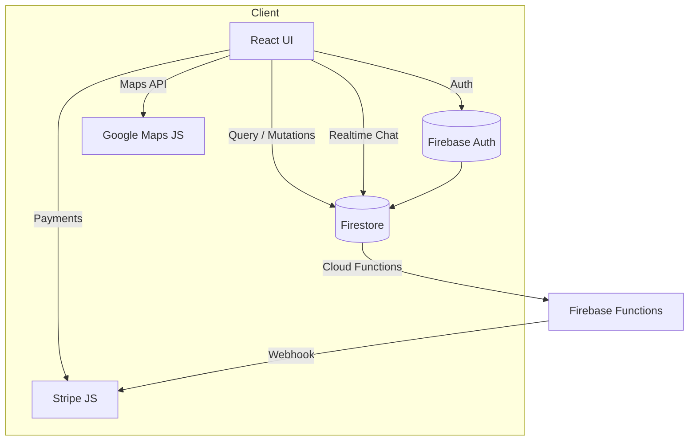

# Обзор проекта **Volio**

Volio — это современная комплексная платформа для волонтёров и малых НКО, сочетающая в себе следующие ключевые цели:

1. **Объединять людей**, стремящихся сделать мир лучше, через участие в офлайн- и онлайн-мероприятиях.  
2. **Давать возможность малым организациям** (НКО, инициативным группам) публиковать свои события на платной подписке без ограничений.  
3. **Развивать социальное взаимодействие** между волонтёрами: система друзей, личный новостной фид, приглашения на мероприятия, встроенный чат.  
4. **Автоматизировать отбор участников** с помощью ранжирования по топ-3 достижениям и фильтров, экономя время организаторов.  
5. **Собирать мгновенный фидбек** через QR-коды на бейджах волонтёров, переводя офлайн-взаимодействие в цифровое.  
6. **Предоставлять «рабочий стол»** (Dashboard) для активных мероприятий: чаты, задачи, материалы и уведомления в одном месте.  
7. **Поддерживать гибкий, динамический интерфейс**, подстраивающийся под роль пользователя (волонтёр, организатор, координатор, аналитик, админ и т.д.).  
8. **Обеспечивать полноценную мультиязычность** (казахский, русский, английский) и тему (Light / Dark) с высоким контрастом для AAA-доступности.

---

## 🔍 Что уже реализовано

- **Моно-репозиторий** (на основе Next.js) с организацией по функциональности:
  - `src/app` — клиентская часть на React + TypeScript + Next.js + TailwindCSS + Framer Motion  
  - `src/types` — общие TS-типы и интерфейсы  
  - `src/services` — сервисы для работы с Firebase (events, chat, friends)
- **Аутентификация**: Firebase Auth + кастомные claims для роли пользователя  
- **Бэкенд-данные**: Firestore с бизнес-правилами (rules v2), субколлекции для чата и друзей  
- **Карты**: Google Maps JS API + кластеризация маркеров + кастомные иконки для разных категорий (онлайн, официальные, неофициальные)  
- **Чат**: хранится в Firestore, поддерживает вложения (Cloud Storage), упоминания и закрепление сообщений  
- **Платёжная система**: Stripe Checkout для подписки малых организаций  
- **i18n**: lazy-loading локалей (`/locales/kk.json`, `/ru.json`, `/en.json`), hook `useT()` для перевода  
- **Тема**: Light / Dark с токенами цвета в `tailwind.config.ts` и автоматическим переключением  

---

## ⚙️ Архитектурная схема



1. **Авторизация**: `onUserCreate` Cloud Function даёт роль `volunteer`.  
2. **Поднятие ролей**: администратор вызывает `approveOrganizer(uid)`, CF обновляет custom claim → клиент видит новые права.  
3. **Публикация событий**: web → Firestore → отображение на карте + списке.  
4. **Подписка НКО**: при оплате Stripe → webhook → CF обновляет `org.subscription.status` → организация получает доступ к разделу "Малые организации".  
5. **Чат / Друзья / Фид**: хранятся в субколлекциях Firestore, обновления рендерятся в реальном времени.  

---

## 🗂 Структура каталогов

```
volio/
├─ src/
│  ├─ app/            # Основные страницы приложения (Next.js App Router)
│  │  ├─ about/       # О проекте
│  │  ├─ admin/       # Админ-панель
│  │  ├─ chat/        # Страница чата
│  │  ├─ events/      # Список и детали событий
│  │  ├─ login/       # Страница входа
│  │  ├─ profile/     # Профиль пользователя
│  │  ├─ settings/    # Настройки
│  │  ├─ small-orgs/  # Раздел для малых НКО
│  │  ├─ layout.tsx   # Основной шаблон страниц
│  │  └─ page.tsx     # Главная страница
│  ├─ components/     # Компоненты UI
│  ├─ context/        # React Context: Auth, Theme, I18n
│  ├─ hooks/          # Кастомные хуки
│  ├─ services/       # Сервисы доступа к данным
│  │  ├─ chat.ts      # Работа с чатом
│  │  ├─ events.ts    # Работа с событиями
│  │  ├─ friends.ts   # Система друзей
│  │  └─ stripe.ts    # Интеграция с платежами
│  ├─ styles/         # Стили и глобальный CSS
│  └─ types/          # TypeScript типы и интерфейсы
├─ public/            # Статические ресурсы
├─ tailwind.config.ts # Конфигурация Tailwind CSS
└─ package.json       # Зависимости проекта
```

---

## 🎯 Основные пользовательские сценарии

1. **Волонтёр**  
   - Регистрируется → выбирает интересы, топ-3 бейджа  
   - Просматривает события → применяет фильтры (категория, геолокация)  
   - Просматривает карту с маркерами → онлайн/официальные/неофициальные  
   - Переходит на страницу события → нажимает "Присоединиться"/"Отозваться"  
   - Участвует в чате мероприятия, получает задачи на Dashboard  
   - Накапливает достижения в профиле → QR-код на бейдже → получение отзыва на месте  

2. **Малое НКО**  
   - Оформляет подписку через Stripe → получает доступ к разделу "Small Orgs"  
   - Публикует неограниченное число событий  
   - Просматривает аналитику по просмотрам/заявкам → экспортирует CSV  
   - Настраивает кастомную иконку и цвета для своих мероприятий  

3. **Организатор / Координатор / Лидер Лиги**  
   - Создает события, управляет участниками  
   - Быстро отбирает кандидатов через ранжирование по топ-3 бейджам  
   - Модерирует чат мероприятия, закрепляет важные объявления  
   - Отправляет групповые приглашения друзьям → офлайн-метка "Пригласил друг"  
   - Получает мобильные уведомления о новых сообщениях, обновлённых документах и задачах  

4. **Администратор / Аналитик**  
   - Управляет ролями и правами через админ-панель (динамическое меню)  
   - Просматривает KPI-дашборды, тепловые карты, отчеты по событиям и пользователям  
   - Настраивает тарифы, логи и параметры безопасности системы  

---

## 🛠 Запуск локально

1. **Клонировать**  
   ```bash
   git clone https://github.com/volio/volio.git && cd volio
   npm install
   ```
2. **Настроить**  
   ```bash
   cp .env.example .env
   # заполнить ключи Firebase, Stripe и Google Maps API_KEY
   ```
3. **Старт**  
   ```bash
   npm run dev
   # Запускает Next.js + эмуляторы Firebase (Auth, Firestore, Functions)
   ```
4. **Тесты & Cборка**  
   ```bash
   npm run test    # Jest + RTL
   npm run build   # Production build
   npm run lint    # ESLint + Prettier
   ```

---

## 🌟 Заключение

**Volio** — это не просто сайт, а **экосистема** для волонтёров, маленьких НКО и организаторов.  
Она сочетает в себе:
- современный UI/UX (Light & Dark, анимации Framer Motion),  
- надёжный бэкенд на Firebase (Auth, Firestore, Cloud Functions, Storage),  
- гибкую архитектуру Next.js App Router для параллельной работы над различными функциями.

> Добро пожаловать в **Volio** – место, где добро становится реальным действием! 